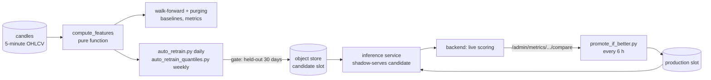

# Pinance ML Training

Research, validation and retraining code for **Pinance**, a real-time crypto price-forecasting system. It forecasts 5-minute log-returns of BTC, ETH, BNB and SOL up to one hour ahead, and keeps a log of every idea that was tested, including the ones that did not work.

Live deployment of the system: <https://pinance.katzer.ru/> (the model served there for BTC/USDT was trained by this code; checked against the public API on 2026-10-04, see [below](#how-it-works)). It may run an earlier build than this repository.


*Directional accuracy of the point model (blue) against the best constant guess (grey), by forecast horizon, pooled over 6 to 8 yearly walk-forward test windows (about 837,000 rows per horizon for BTC, ETH, BNB; 599,000 for SOL). BTC and ETH are 2 to 3 pp above the constant, BNB and SOL about 1 to 1.5 pp. Drawn by [`docs/figures/make_figures.py`](docs/figures/make_figures.py) from the committed [`reports/`](reports/) files.*

> **Not a trading signal and not financial advice.** Forecasting crypto returns on a 5-minute horizon is close to the limit of predictability, and the results below say so. The repository demonstrates how to evaluate such a model honestly: leakage-free time-series validation, naive baselines, paired significance tests, and a production loop that promotes a model only when evidence supports it.

## What this project demonstrates

- **An evaluation that does not flatter the model.** Walk-forward with purging, always against two naive baselines. For BTC the model's directional accuracy is **53.14 %** against **50.45 %** for the best constant (8 of 8 yearly windows, p < 0.001), while its error is **no smaller than predicting zero** (+0.25 %, p = 0.29). Both facts are reported. [Method and tables](docs/evaluation.md)
- **Negative results kept as results.** FinBERT news features, LoRA fine-tuning, an LLM event classifier, a 24-hour horizon, cross-article novelty and a 144-cell hyperparameter grid all showed no out-of-sample gain; every news interval contains zero. The grid winner gained +0.42 pp on the folds that selected it and lost 0.16 pp on the held-out ones. [Verdicts](docs/evaluation.md#verdicts)
- **A bug the model metrics could not see.** A cumulative volume indicator depends on where the series starts, so training (years of history) and serving (150 candles) saw different values (about 73 % apart in the repository's synthetic regression test; not measured on real candles). Offline MAE and accuracy did not move (p = 0.098 and 0.52); a parity test now fails if it comes back. [Story](docs/design-decisions.md#5-the-obv-train-serve-skew)
- **A promotion loop with two independent gates.** Daily retrain gated on a held-out window, then promotion decided on live shadow traffic; point model and confidence corridor are separate decisions since an incident on 2026-08-03. [Design](docs/design-decisions.md#6-point-model-and-corridor-are-independent-decisions)
- **235 offline unit tests**, no database or network needed, plus a runnable demo of the whole harness on synthetic data.

## Contents

[Idea](#idea) · [Features](#features) · [How it works](#how-it-works) · [Results](#results) · [Quick start](#quick-start) · [Usage examples](#usage-examples) · [Configuration](#configuration) · [Command-line reference](#command-line-reference) · [Repository layout](#repository-layout) · [Tests and quality](#tests-and-quality) · [Deployment](#deployment) · [Limitations](#limitations) · [Related repositories](#related-repositories) · [License](#license)

Further reading in `docs/`:

| File | What is there |
|---|---|
| [docs/evaluation.md](docs/evaluation.md) | method, four caveats, a verdict table and every experiment (15 sections) with numbers traced to CSV files, plus corrections to the earlier summary |
| [docs/features.md](docs/features.md) | data and targets, the 93/94 features, validation harness, models, sanity gate, retrain and promotion scripts, slot storage, news pipeline, script catalogue |
| [docs/design-decisions.md](docs/design-decisions.md) | twelve decisions with alternatives and two incidents, then what was rejected and what was deliberately not done |
| [docs/deployment.md](docs/deployment.md) | timers and units, the daily/weekly/6-hourly cycle, schema-change procedure with a real log, MLflow, object store, news parser |
| [docs/examples/](docs/examples/) | synthetic demos with saved output, a real slot `metadata.json` and a real retrain audit log |

## Idea

A forecast model that predicts a noisy series will always look better than it is unless it is measured against the right floor. Here the floor is explicit: "predict zero" for error size and "always guess the commonest sign" for direction. Everything else follows from taking that floor seriously:

1. **The question is "better than what?"** The point model sits on the naive floor for error and clears it only for direction, by 2 to 3 pp for BTC and ETH. That is the finding, and the repository is organised so it cannot be inflated by leakage: the target is a log-return (a price target is dominated by the current price), each of 12 horizons has its own model, and the training set stops 12 rows before every test window because those rows' targets look into it.
2. **Every idea gets a test it can fail.** Where a script records a success bar, it was written before the first run, and falling short closes the hypothesis rather than prompting variants. Eight yearly folds cannot resolve differences under about 1.5 pp, so interval estimates, `n`-weighted pooling and a day-block bootstrap are used, and results that depend on notes instead of committed files are labelled.
3. **The serving path is part of the model.** Training and serving share one pure feature function, a parity test compares them, and candidate models are judged twice: offline, then on live shadow traffic.

## Features

Full descriptions with code and test pointers: [docs/features.md](docs/features.md).

- **Features and targets.** 93 features per candle (94 for non-BTC symbols, which add BTC's return): 24 lags of return and volume, rolling statistics on four windows, RSI, MACD, Bollinger width, ATR, a windowed OBV, cyclical time. Targets `r_1..r_12` by exact timestamp. A pure function with no-look-ahead and serving-parity tests.
- **Validation harness.** Walk-forward with purging, `n`-weighted fold pooling, paired tests, and a day-block bootstrap for directional accuracy.
- **Models.** 12 direct `LGBMRegressor` models (L1 objective) per symbol; 24 quantile models (0.1 and 0.9) for the confidence corridor; baselines; a naive-baseline sanity gate for schema changes.
- **Retrain and promotion.** `auto_retrain.py` (daily), `auto_retrain_quantiles.py` (weekly), `promote_if_better.py` (every 6 hours, live gate), `promote_new_scheme.py` (manual, dry-run by default, one-level rollback). Fixed `production`, `candidate`, `previous` slots in an S3-compatible store; the inference service hot-reloads on `model_version`.
- **News pipeline.** RSS, GDELT, sitemap and WordPress sources, near-duplicate removal, FinBERT, an LLM event classifier (Qwen2.5-3B on CPU), time-decayed features keyed on publication time, LoRA fine-tuning. All of it ended without a gain; the code stays because the negative result is only credible next to it.
- **Observability.** Optional MLflow tracking and a best-effort event journal to the backend; both are silent no-ops when not configured.
- **Experiment log.** About 40 scripts, the result CSV for each in `reports/`, and an English write-up of all of them.

## How it works



Retraining is a daily systemd timer (the corridor weekly). Each run trains a candidate on the full history, gates it against production on a held-out window, and pushes it to the `candidate` slot, never directly to production. `promote_if_better.py` promotes it only if it also holds up on live shadow traffic. Point model and corridor are two independent decisions. A change of the feature schema takes a separate, manual path. Details and logs: [docs/deployment.md](docs/deployment.md).

The model served by the live system for BTC/USDT on 2026-10-04 (`GET /snapshot/BTC%2FUSDT`: model `202610021348-4de49a70`, corridor `202610021525-4de49a70`, schema `38b98fc7516d`, 93 features) is the one described by [`docs/examples/slot-metadata-BTCUSDT.json`](docs/examples/slot-metadata-BTCUSDT.json), trained at commit `4de49a7` of this repository and promoted on 2 October 2026 by `promote_new_scheme.py` ([log](docs/examples/retrain-log-BTCUSDT.jsonl)).

Key decisions, one line each (full reasoning in [docs/design-decisions.md](docs/design-decisions.md)):

| Decision | Reason |
|---|---|
| Log-return target, one direct model per horizon | no error accumulation; horizons judged separately |
| Purge 12 rows before every boundary | the last training targets reach into the test window |
| Expanding window, equal weights | sliding windows and decay weights both measured worse |
| Pooling weighted by `n_test` | an unweighted mean flipped the sign of a result (6 h horizon) |
| Point and corridor retrained and promoted separately | a rejected point model once rode into production with an approved corridor |
| Offline gate, then live shadow gate | a held-out window is necessary but not sufficient |
| Fixed slots, version inside `metadata.json` | the inference service re-polls the same keys, never lists a bucket |
| Schema changes need a sanity gate and a human | live metrics across different inputs are not comparable |

## Results

Walk-forward with purging, yearly test windows 2018-08 to 2026-07 (8 folds; 6 for SOL from 2020-11), 12 horizons (5 to 60 minutes), expanding training window, about 105,000 test rows per fold and horizon. Rows overlap in time, so `n` overstates the independent sample. Method, caveats, every number's source: [docs/evaluation.md](docs/evaluation.md).

**Point model (LightGBM, committed `DEFAULT_PARAMS`) against the naive baselines** ([`make_figures.py`](docs/figures/make_figures.py), output in [`figure_numbers.txt`](docs/figures/figure_numbers.txt)):

| Symbol | Folds | MAE vs `r = 0` | p | Directional accuracy | Constant | Change | Folds better | p |
|---|---|---|---|---|---|---|---|---|
| BTCUSDT | 8 | +0.25 % | 0.29 | 53.14 % | 50.45 % | **+2.69 pp** | 8/8 | < 0.001 |
| ETHUSDT | 8 | +2.72 % | 0.30 | 52.47 % | 50.23 % | **+2.23 pp** | 8/8 | < 0.001 |
| BNBUSDT | 8 | +1.29 % | 0.10 | 50.79 % | 49.69 % | +1.10 pp | 7/8 | 0.03 |
| SOLUSDT | 6 | +6.27 % | 0.30 | 50.56 % | 49.15 % | +1.41 pp | 6/6 | < 0.001 |

Paired t-test across folds, `n_test`-weighted pooling, no correction for four symbols. Reading: the model does not beat "predict zero" on error size, but its sign is right a few points more often than the best constant, mostly for BTC and ETH. It is before transaction costs and is not a trading result. The edge is also not stable: BTC directional accuracy falls from 53.96 % in the first window to 52.37 % in the last ([figure](docs/media/da-btc-by-year.png)).


*Relative MAE per yearly window. Early windows of ETH, BNB and SOL are 4 to 19 % worse than predicting zero; the last two windows of every symbol are within about 0.5 %.*

**Ideas that were tested and did not help** (success bars, where a script records one, are listed in the [verdict table](docs/evaluation.md#verdicts)):

| Idea | Outcome |
|---|---|
| FinBERT news features, time-decayed | change in DA between -0.03 and +0.02 pp on four symbols, every 95 % interval contains zero |
| LoRA fine-tuning of FinBERT on market-derived labels | five configurations, loss at chance; downstream +0.045 pp (p = 0.09); line closed |
| LLM event type (Qwen2.5-3B) | related to the **size** of the move, not the sign; -0.03 pp DA (p = 0.59) |
| 24-hour horizon, 2 to 6 hour horizons | no out-of-sample predictability |
| Cross-article novelty | formally passed a weak criterion, p = 0.77, read as null |
| Order-flow imbalance, funding rate, volatility-scaled target | screened; none carried over; the result files were lost ([details](docs/evaluation.md#14-experiments-whose-reports-did-not-survive)) |
| Sliding or recency-weighted training windows | worse at every setting tried |
| Event type and magnitude in the corridor | +0.12 % against a 1 % bar, p = 0.135 |
| Hyperparameter search (144-cell grid, `reg_strong`) | grid winner +0.42 pp on selection folds, -0.16 pp on held-out; `reg_strong` held-out interval [-0.006, +0.139] pp |


*Every news experiment, as a change in directional accuracy with a 95 % interval across folds. All contain zero.*

**The baseline confidence corridor** (quantile models at 0.1 and 0.9, BTCUSDT, 9 folds) is calibrated out of sample: pooled coverage **0.105** and **0.906** against nominal 0.1 and 0.9 ([figure](docs/media/corridor-coverage.png)). On the live system the lower bound is exceeded by only 4.5 % of BTC outcomes over long windows against a 10 % target (see the [backend](https://github.com/GKatzer/Pinance_backend) repository), so offline calibration did not carry over.

**The `obv` fix.** Replacing cumulative OBV by a windowed rate of change moved BTC walk-forward MAE by -0.13 % (p = 0.098) and directional accuracy by +0.05 pp (p = 0.52): no visible offline effect. The damage was in serving, where the feature had a different distribution (about 73 % apart in the synthetic regression test; the size depends on history length and was not measured on real candles).  *Left, middle: real BTC walk-forward results before and after. Right: the mismatch of both formulas on synthetic random-walk candles (not market data).*

## Quick start

Requirements: Linux (the only platform tested), Python 3.12 (3.12.3 used), [uv](https://docs.astral.sh/uv/) or pip. What you cannot do without access to the private candle database: re-run any walk-forward experiment. The result files are committed so the numbers can be checked, and the harness runs on synthetic data.

```bash
git clone https://github.com/GKatzer/Pinance_ml_training.git && cd Pinance_ml_training
uv venv .venv && uv pip install -p .venv pandas numpy scipy scikit-learn lightgbm ta python-dotenv \
    sqlalchemy minio requests feedparser trafilatura pytest matplotlib
export DATABASE_URL=postgresql://unused/unused      # config.py requires the variable; no connection is made
```

Tests (executed 2026-10-04, clean `uv venv`, Python 3.12.3):

```bash
.venv/bin/python -m pytest -q
```
```
235 passed, 1 warning in 6.71s
```

The whole harness on generated data (about 30 s; executed; re-running gives the same output except the final timing line):

```bash
.venv/bin/python docs/examples/synthetic_walkforward_demo.py
```

Redraw every figure from the committed result files (12 s):

```bash
.venv/bin/python docs/figures/make_figures.py > docs/figures/figure_numbers.txt
```

The full install (`pip install -r requirements.txt`, which adds torch, transformers, peft and llama-cpp-python for the news and LLM scripts) was **not run** for this README; the light install above is enough for the tests, the demo and the figures.

With a database (**not run here**: needs a TimescaleDB with a `candles` table, see [Usage](#usage-examples)):

```bash
cp .env.example .env                         # set DATABASE_URL (read-only role)
python scripts/run_naive_baseline.py BTCUSDT
python scripts/train_lightgbm.py BTCUSDT     # walk-forward, writes reports/lightgbm_folds.csv
```

## Usage examples

**The harness on synthetic candles** (real output of `docs/examples/synthetic_walkforward_demo.py`, shortened; the full output is [saved](docs/examples/synthetic_walkforward_demo.out.txt)). The generator plants a 12 % autocorrelation, so the model finds direction above 50 % here only because it was put there:

```
synthetic candles: 95,040 rows, 2024-01-01 .. 2024-11-25
dataset: 95,040 rows, 93 features, 12 targets (r_1..r_12), purge = 12 rows
walk-forward: 4 folds (expanding train, 60-day test windows)
 horizon     mae  naive_mae  mae_vs_naive_%  directional_accuracy  naive_da  da_vs_naive_pp
       1 0.00066    0.00066        -0.58193               0.53470   0.49690            3.78
       6 0.00179    0.00179         0.34907               0.49981   0.49676         0.30529
      12 0.00255    0.00254         0.67425               0.50327   0.49489         0.83782
mean over horizons: DA 50.71% (naive 49.64%), MAE 0.001778 (naive 0.001771)
serving parity on the last candle: 93 comparable features
  obv_roc_36: full 0.0438088980  window 0.0438088980  (exact)
```

**The serving-parity test catching the old OBV.** With the cumulative formula restored in a scratch copy:

```
FAILED tests/test_pipeline.py::test_serving_window_features_match_full_history
E   At positional index 91, first diff: -4880.555293584177 != -1296.17...
1 failed, 8 passed
```

and with the committed code `9 passed`.

**What a promoted slot records** ([full file](docs/examples/slot-metadata-BTCUSDT.json), abbreviated):

```json
{ "symbol": "BTCUSDT", "schema_version": "38b98fc7516d", "model_version": "202610021348-4de49a70",
  "horizons": [1, 2, "...", 12], "quantile_levels": [0.1, 0.9], "n_rows": 883862,
  "eval_metrics": { "candidate_avg_mae": 0.001745, "candidate_avg_dir_acc": 0.5267,
    "sanity": { "passed": true, "naive_avg_mae": 0.001753, "naive_avg_dir_acc": 0.5093 },
    "decision": "schema_drift_push_as_candidate" },
  "new_scheme": true, "replaces_schema_version": "21c8984f3440",
  "feature_baseline": { "atr": { "mean": 85.7, "bin_edges": ["..."] }, "...": "6 drift features" } }
```

**The audit log of the promotion** (one line, [all seven](docs/examples/retrain-log-BTCUSDT.jsonl)): `"log": "promote_new_scheme", "symbol": "BTCUSDT", "checked_at": "2026-10-02T18:55:54...", "dry_run": false, "point_promoted": true, "quantile_promoted": true, "candidate_schema_version": "38b98fc7516d", "production_schema_version": "21c8984f3440"`.

**Experiment tracking** ([docs/deployment.md](docs/deployment.md#mlflow)): a local MLflow server filled by `docs/examples/mlflow_demo.py` with three synthetic runs, drawn with the repository's own tracking wrapper.


*One synthetic run as MLflow shows it: tags (`decision: rejected`), six metrics, parameters. Synthetic data, local throw-away server.*

## Configuration

Read by [`src/pinance_ml/config.py`](src/pinance_ml/config.py) from the environment, then from `.env`; verified against the code by `grep`. The template is [`.env.example`](.env.example). **`DATABASE_URL` is read at import time with `os.environ[...]`: without it, importing the package (and so running any test) raises `KeyError`.**

| Variable | Meaning | Default | Required |
|---|---|---|---|
| `DATABASE_URL` | read-only SQLAlchemy URL of the candle database; a placeholder is enough for tests and demos | none | yes |
| `NEWS_DATABASE_URL` | write role for the news tables | `DATABASE_URL` | no |
| `MINIO_ENDPOINT`, `MINIO_ACCESS_KEY`, `MINIO_SECRET_KEY` | object store connection | empty | for push and promote |
| `MINIO_SECURE` | use TLS (`false`, `0`, empty disable) | `true` | no |
| `MINIO_MODELS_BUCKET` | bucket of model slots | `pinance-models` | no |
| `AUTO_RETRAIN_HOLDOUT_DAYS` | width of the held-out comparison window | `30` | no |
| `AUTO_RETRAIN_MIN_IMPROVEMENT` | relative improvement over production required to push | `0.005` | no |
| `SANITY_MAX_MAE_RATIO` | schema-change gate: candidate MAE at most this multiple of naive MAE | `1.02` | no |
| `SANITY_MIN_DIR_ACC_EDGE` | schema-change gate: directional-accuracy edge over the naive constant | `0.0` | no |
| `SANITY_MAX_PINBALL_RATIO` | same for the corridor's pinball loss | `1.02` | no |
| `PREDICTOR_BACKEND_URL` | backend admin API for live metrics and the event journal; empty makes the journal a no-op, and `promote_if_better.py` refuses to start | empty | for promotion |
| `PREDICTOR_BACKEND_TIMEOUT_S` | HTTP timeout (`/compare` computes five windows at once) | `60` | no |
| `PROMOTION_WINDOW` | live comparison window | `7d` | no |
| `PROMOTION_MIN_SAMPLES` | resolved live samples required before a candidate is judged | `100` | no |
| `PROMOTION_MIN_ACCURACY_IMPROVEMENT_PP` | required live directional-accuracy edge, percentage points | `1.0` | no |
| `PINANCE_MLFLOW_TRACKING_URI` | MLflow server; empty disables tracking | empty | no |
| `NEWS_FINBERT_MODEL` | FinBERT model name or path | `ProsusAI/finbert` | no |
| `NEWS_LLM_MODEL_PATH` | GGUF file for event-type extraction | `models/qwen2.5-3b-instruct-q4_k_m.gguf` | Level 2 only |
| `NEWS_LLM_GPU_LAYERS` | llama.cpp layers on GPU (0 = CPU, -1 = all) | `0` | no |

The MLflow client additionally reads `MLFLOW_S3_ENDPOINT_URL`, `AWS_ACCESS_KEY_ID` and `AWS_SECRET_ACCESS_KEY` itself; this repository does not parse them.

## Command-line reference

Production scripts; every `--help` output was checked. Experiment scripts (`measure_*`, `screen_*`, `compare_*`, ...) take a symbol and write to `reports/`; the catalogue is in [docs/features.md](docs/features.md#script-catalogue).

| Script | Arguments |
|---|---|
| `train_lightgbm.py`, `run_naive_baseline.py` | `[symbols ...]` (default: all in the table), `--out OUT` |
| `export_models.py` | `[symbols ...]`, `--start DATE` or `--window-days N`, `--out DIR`, `--include-quantiles` |
| `auto_retrain.py`, `auto_retrain_quantiles.py` | `[symbols ...]`, `--holdout-days`, `--min-improvement`, `--staging-dir` (default `.auto_retrain_staging`, git-ignored) |
| `promote_if_better.py` | `[symbols ...]`, `--window`, `--min-samples`, `--min-accuracy-improvement-pp`, `--staging-dir`, `--dry-run` |
| `promote_new_scheme.py` | `[symbols ...]`, `--apply`, `--rollback`, `--label-legacy`, `--skip-sanity-check`, `--staging-dir` (dry run unless `--apply`) |

## Repository layout

```
src/pinance_ml/
  config.py          constants and environment (horizons, purge, thresholds, news settings)
  dataset.py         features + targets joined; which columns are model inputs
  features/          pipeline.py (pure feature function), targets.py
  splits.py          walk-forward folds with purging; recency weights
  evaluation.py      n-weighted pooling, day-block bootstrap
  metrics.py         MAE, directional accuracy, pinball loss, coverage
  baselines/naive.py r = 0 and majority-sign baselines
  sanity.py          naive-baseline gate for schema changes
  models/            LightGBM point and quantile models
  model_storage.py   object-store slots, metadata merge, promotion, rollback, consistency check
  tracking.py        optional MLflow wrapper
  backend_client.py  best-effort event journal to the backend
  data/              db.py (candles), news_db.py (news tables)
  news/              RSS/GDELT/sitemap/WordPress sources, sentiment, LLM extraction, decay, labels
scripts/             ~40 scripts: production loop, news operations, experiments (docs/features.md)
reports/             result CSVs (+ gridsearch/), logs, README.md (original Russian summary)
tests/               235 unit tests, 24 files
sql/news_schema.sql  news table
deploy/              systemd units and runbooks: auto_retrain, promote_if_better, promote_new_scheme,
                     news_parser, minio, mlflow
docs/                evaluation, features, design decisions, deployment; figures/make_figures.py;
                     examples/ (synthetic demos, real metadata and audit log); media/ (8 PNG, 0.8 MB)
.env.example, requirements.txt, pyproject.toml (pytest path only), LICENSE
```

About 13,000 lines of Python in `src`, `scripts` and `tests`.

## Tests and quality

235 tests, 24 files, all offline; `python -m pytest -q` runs in about 7 seconds. What they cover:

| Area | Tests | Examples |
|---|---|---|
| Features and targets | 18 | no look-ahead on a prefix, determinism, cyclical encoding, BTC cross-feature alignment on gaps, serving-window parity |
| Walk-forward and evaluation | 18 | purge before the boundary, folds tile without overlap, sliding window bound, pooled metrics, block bootstrap |
| Models, metrics, baselines | 24 | per-horizon models, quantile models, MAE, accuracy, pinball loss, coverage, naive baselines |
| Sanity gate | 8 | NaN metrics, MAE and accuracy thresholds, corridor calibration |
| Retrain, promotion, storage | 76 | decision tables of `auto_retrain*`, `promote_if_better` (27), `promote_new_scheme` (12), slot layout, metadata merge, consistency, rollback |
| Export, tracking, backend client | 14 | metadata schema, silent no-op behaviour of MLflow and the journal |
| News | 77 | RSS parsing and dedup, GDELT, sitemap, WordPress API, sentiment heuristics, decay, labels |

What is **not** covered: the scripts' `main()` functions end to end (they need a database, an object store and a backend), the experiments' statistics code beyond `evaluation.py`, the systemd units, and anything that talks to real services. There is **no CI workflow in this repository**, so a "tests pass" statement rests on local runs only. There is no linter configuration; `pyproject.toml` only sets the pytest path.

## Deployment

One training host runs four systemd timers, `auto-retrain.timer` (daily 03:00), `auto-retrain-quantiles.timer` (Sunday 04:30), `promote-if-better.timer` (00, 06, 12, 18 h) and `news-parser.timer` (every 5 minutes), plus MinIO and MLflow as always-on services. The inference service reads the same object store; the backend scores both slots live. Runbooks, the schema-change procedure with a real audit log, and the verification status are in [docs/deployment.md](docs/deployment.md). Nothing in the units was executed for this README.

## Limitations

- **Not reproducible without private data.** Every walk-forward result needs a TimescaleDB table of about 880,000 5-minute candles per symbol (and, for news experiments, a news database). The CSVs are committed; the code path is demonstrated on synthetic data only.
- **Small, shrinking edge.** Directional accuracy is 2 to 3 pp above a constant for BTC and ETH, declines over the years (BTC 53.96 % to 52.37 %), and disappears after transaction costs, which are not modelled.
- **Coarse statistics.** Eight yearly folds, overlapping targets, p-values not corrected for four symbols; a difference below about 1.5 pp is invisible to the fold-level test.
- **Part of the evidence is not in the repository.** Several numbers come from working notes (cross-article novelty, 2 to 6 h weighted values, the LoRA configurations, the LLM backfill), and the result files of the vol-scaled target, funding and OFI work were lost. Each is labelled in [evaluation.md](docs/evaluation.md).
- **`reg_strong` is not in the code.** The earlier summary says it was adopted on 2026-08-30; `DEFAULT_PARAMS` is unchanged, the retrain scripts do not pass parameters, and on the data in `reports/gridsearch/` its held-out interval includes zero. The tables here use the committed defaults.
- **Only BTC re-evaluated after the `obv` change.** ETH, BNB and SOL were not.
- **Corridor calibration did not transfer.** Offline coverage is on target; live, the lower bound is too conservative over long windows.
- **Feature-drift baseline is written but unused.** Slot metadata carries a baseline for six features; the backend has no drift endpoint to consume it.
- **Promotion across a feature-schema change is manual**, and rollback is one level deep.
- **No CI, no linter**, and the full dependency install (`requirements.txt`: torch, transformers, peft, llama-cpp-python) was not run for this README.
- **Language.** Code comments are partly in Russian and refer to internal host roles; `reports/README.md` is the Russian original of [evaluation.md](docs/evaluation.md).
- **Scope.** Binance spot, 5-minute candles, four pairs; only Linux with Python 3.12 was used.

**Possible next steps** (suggestions, not planned work): re-evaluate ETH, BNB, SOL after the `obv` change; decide whether `reg_strong` is adopted and, if so, put it in code and re-run section 2; recover or redo the lost screens; wire the drift baseline into the backend; add CI.

## Related repositories

```
Binance WebSocket ─► backend (FastAPI, TimescaleDB, Redis) ──► predictions, live shadow metrics
                           │ candles                                   ▲
                           ▼                                           │ /admin/metrics
   Pinance_ml_training:  features ─► walk-forward ─► LightGBM ─► MinIO (candidate slot) ─► inference service
   (training)                                              │                    (shadow-serves it)
                                                           └─ promote_if_better ─► MinIO (production slot)
```

This repository is the "training" box: it computes features, validates models, retrains, gates and promotes them, and consumes the backend's live shadow metrics.

| Repository | Role |
|---|---|
| **Pinance_ml_training** (this) | features, validation, experiments, retraining, promotion |
| [Pinance_ml_inference](https://github.com/GKatzer/Pinance_ml_inference) | model-serving service; polls MinIO, serves production and shadow candidate |
| [Pinance_backend](https://github.com/GKatzer/Pinance_backend) | candle ingestion, API, prediction store, live metrics |
| [Pinance_frontend](https://github.com/GKatzer/Pinance_frontend) | web UI: live forecast, model performance, MLOps, methodology |

## License

License: MIT, see [LICENSE](LICENSE).
Author: George Denisov · [GitHub](https://github.com/GKatzer) · [Telegram](https://t.me/denisov_george)
