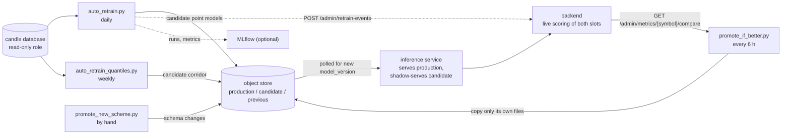
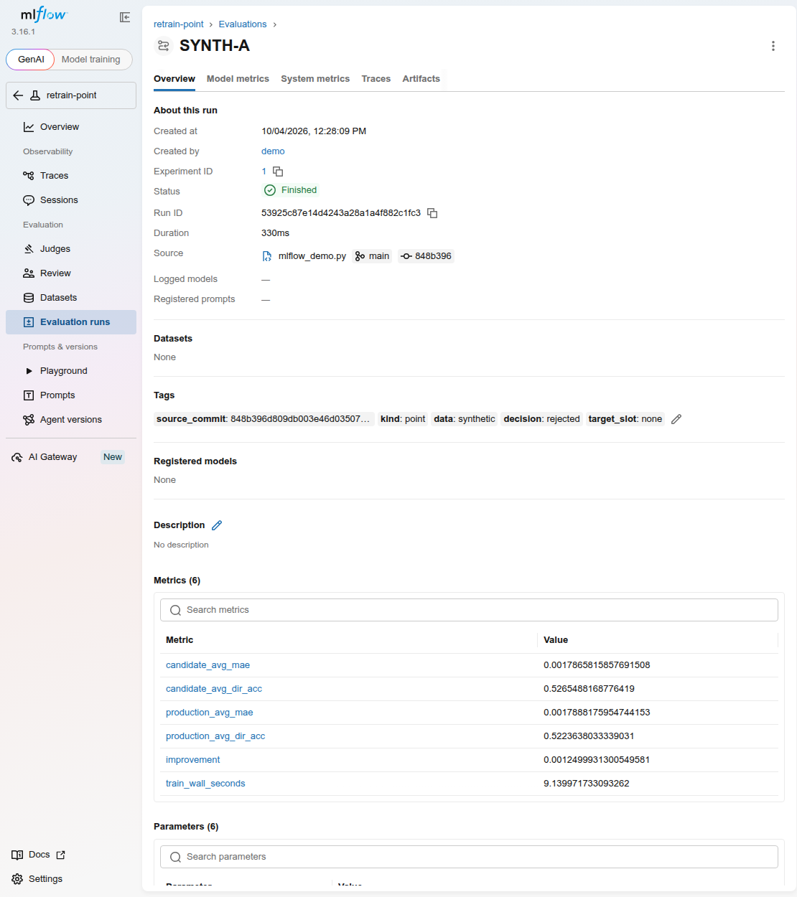

# Deployment

How the training side runs in production: which units exist, in what order they act, and what each decision looks like in the logs. The unit files are in [`deploy/`](../deploy/); each subfolder has its own runbook. **None of the commands in this document were executed while writing it**: they need a systemd host, a private database and an object store. What was run is listed under [Verification](#verification).

The addresses of the hosts are not part of this repository. The runbooks use `<training-host>`, `<backend-host>`, `<inference-host>` and similar placeholders; in the real deployment these are machines on a private network.

## Contents

[Roles](#roles) · [Timers](#timers-and-the-daily-weekly-cycle) · [Staging and permissions](#staging-and-permissions) · [Schema changes](#schema-changes) · [MLflow](#mlflow) · [Object store](#object-store) · [News parser](#news-parser) · [Configuration](#configuration) · [Verification](#verification)

## Roles



The training host holds the code, the timers, the object store and (optionally) MLflow. The inference service only reads the object store. The backend is the source of truth for live accuracy.

## Timers and the daily-weekly cycle

| Unit | Schedule | Runs | What it does |
|---|---|---|---|
| `auto-retrain.timer` | daily 03:00 (host time zone) | `scripts/auto_retrain.py` | per symbol: holdout the last 30 days, train an evaluation candidate, compare with downloaded production on that window, and if it beats production's average MAE by at least 0.5 % train a final model on **all** history and push to `candidate` |
| `auto-retrain-quantiles.timer` | Sunday 04:30 | `scripts/auto_retrain_quantiles.py` | same for the corridor: pooled pinball loss and coverage within 0.03 of 0.1 / 0.9 |
| `promote-if-better.timer` | 00:00, 06:00, 12:00, 18:00 | `scripts/promote_if_better.py` | per symbol, two independent decisions on live shadow metrics; promotes through MinIO copies |
| `news-parser.timer` | 1 minute after boot, then every 5 minutes after the previous run ends | `fetch_news.py`, `score_pending_news.py` | one poll of 7 RSS feeds, then FinBERT scoring of pending rows; each `ExecStart` is prefixed with `-` so a failed step neither blocks the other nor fails the unit |
| (service, no timer) | always | MinIO, MLflow | `minio.service`, `mlflow.service` |

All oneshot services run as an unprivileged `pinance` user with `Nice=10`, read `/opt/Pinance_ML/.env`, and have `Persistent=true` timers, because the training host is not up around the clock: a tick missed while it was off fires once on the next boot.

The 6-hour promotion interval is not tuned against the retrain times. A candidate that landed minutes ago has too few resolved live samples (`PROMOTION_MIN_SAMPLES = 100`) and is skipped as `insufficient_samples`; a later run re-evaluates it with more data. The sample floor, not the schedule, paces promotion.

Decision labels written to the audit lines:
- `auto_retrain.py`: `bootstrap`, `pushed_to_candidate`, `rejected`, `schema_drift_push_as_candidate`, `schema_drift_rejected_sanity`.
- `promote_if_better.py` point decision: `no_candidate`, `no_production`, `insufficient_samples`, `no_comparable_metrics`, `point_model_rejected`, `accuracy_improved`, `not_better`; corridor: `no_candidate`, `no_production`, `no_new_quantiles`, `insufficient_samples`, `quantile_unverified`, `quantile_gain`; on a schema change both become `new_scheme_manual_promotion_required`.

Operating (from the runbooks, commands for a systemd host):

```bash
systemctl status promote-if-better.timer            # next and last run
journalctl -u promote-if-better.service -f          # follow a run
sudo systemctl start promote-if-better.service      # run once, now
python scripts/promote_if_better.py --dry-run       # decide and log, never promote
```

## Staging and permissions

Scripts download production models and write their audit logs to `--staging-dir` (default `.auto_retrain_staging`, git-ignored). The timers run as `pinance` and own that directory, so a manual run as another user fails with `PermissionError` when the script clears its download folder. Use your own directory for manual runs:

```bash
python scripts/auto_retrain.py BTCUSDT --staging-dir .manual_staging
```

Artifacts are in the object store, not in git; local staging is scratch. Representative contents of a slot's metadata and of the audit logs are in [`docs/examples/`](examples/).

## Schema changes

Changing, adding or reordering a feature changes `schema_version`. From that moment production's models cannot be compared with a new candidate, and the inference service rejects the old models once the new schema is live. The path:

1. The next retrain detects the mismatch, trains, and runs the naive-baseline sanity gate on the held-out window. Fail: `schema_drift_rejected_sanity`, nothing is pushed. Pass: pushed to `candidate` with `new_scheme: true` and the verdict stored in the metadata.
2. `promote_if_better.py` sees the changed schema and reports `new_scheme_manual_promotion_required` with an `ACTION REQUIRED` line. It never promotes such a candidate.
3. A human runs `scripts/promote_new_scheme.py` from a checkout whose feature code matches the candidate's `source_commit`: dry run first, then `--apply`. Promote the point model and the corridor **together**, otherwise production holds two halves on different schemas (the post-check logs `mixed schema`). Every apply snapshots production to `previous`; `--rollback --apply` restores it, and only helps together with rolling back the feature code. A recorded sanity failure cannot be overridden; legacy candidates without labels need an explicit `--label-legacy` or `--skip-sanity-check`, which is written to the audit log.

The real sequence of the `obv` change, for BTCUSDT on 2 October 2026 (from [`retrain-log-BTCUSDT.jsonl`](examples/retrain-log-BTCUSDT.jsonl)): retrains at 10:04 and 13:48 UTC with decision `schema_drift_push_as_candidate` (the second with a passed sanity gate: candidate MAE 0.0017453 against naive 0.0017527, directional accuracy 52.67 % against 50.93 %), the corridor at 15:25, dry runs of `promote_new_scheme.py` at 12:00, 16:26 and 18:55, and the apply at 18:55:54 (`point_promoted: true`, `quantile_promoted: true`). This is the history behind the live model version `202610021348-4de49a70`.

## MLflow

Optional. [`deploy/mlflow/`](../deploy/mlflow/) runs `mlflow server` as a systemd unit next to the object store, with a PostgreSQL backend store and an S3-compatible artifact bucket (`pinance-mlflow`, separate from the models bucket and with its own scoped key). Experiments written by the code:

| Experiment | Written by | One run per |
|---|---|---|
| `retrain-point` | `auto_retrain.py` | symbol, per scheduled retrain |
| `retrain-quantile` | `auto_retrain_quantiles.py` | symbol, per scheduled retrain |
| `research-feature-gain` | `measure_*.py` | invocation |
| `research-screening` | `screen_*.py` | invocation |

Models are not stored in MLflow; the object store remains the only place that decides what serves. If `PINANCE_MLFLOW_TRACKING_URI` is unset, the server is down, or `mlflow` is not installed, every helper in [`tracking.py`](../src/pinance_ml/tracking.py) is a silent no-op, so tracking can be stood up or torn down without touching the schedule. The mlflow client reads its artifact credentials (`MLFLOW_S3_ENDPOINT_URL`, `AWS_ACCESS_KEY_ID`, `AWS_SECRET_ACCESS_KEY`) straight from the environment. Research runs happen on a workstation as much as on the server, so a workstation needs the same bucket-scoped key or its runs lose their artifacts. The server env file contains an allowlist of hosts and CORS origins (`MLFLOW_SERVER_ALLOWED_HOSTS`, `MLFLOW_SERVER_CORS_ALLOWED_ORIGINS`); private-network addresses are not in MLflow's default DNS-rebinding allowlist and get HTTP 403 until listed.

The real `deploy/mlflow/mlflow.env` is machine-specific and git-ignored; `mlflow.env.example` is the template.



*What one run looks like. This is a **local MLflow 3.16.1 server with a throw-away sqlite store, filled with three synthetic runs** by [`docs/examples/mlflow_demo.py`](examples/mlflow_demo.py), which calls the repository's own `pinance_ml.tracking` wrapper with the same experiment, metric, parameter and tag names as `auto_retrain.py` (output: [`mlflow_demo.out.txt`](examples/mlflow_demo.out.txt)). The numbers are meaningless; here `candidate` and `production` are two LightGBM configurations on generated candles, and the decision `rejected` shows the 0.5 % improvement gate at work. Screenshots of the real instance are not included: it sits on a private network.*

## Object store

[`deploy/minio/`](../deploy/minio/): a single MinIO binary under systemd (`minio.service`), data in `/opt/minio/data`, a dedicated system user, bind and console addresses from `minio.env` (template `minio.env.example`; generate real keys on the host, never commit them). Bucket `pinance-models` (default; `MINIO_MODELS_BUCKET`) holds `{symbol}/production|candidate|previous/`, see [features.md](features.md#artifact-storage). The runbook has no backup step beyond the host's own.

## News parser

[`deploy/news_parser/`](../deploy/news_parser/): FinBERT weights (about 1.5 GB of torch and transformers) are cached under `CacheDirectory=` with `HF_HOME` pointing there. Systemd was chosen over Docker because two short periodic scripts are the textbook timer case and a container added overhead (model weights, a private-network workaround for the database, slower edit-deploy cycles). After a code change a `git pull` is enough; the next tick uses it. The unit files hardcode `/opt/Pinance_ML` and user `pinance` as placeholders; edit `WorkingDirectory`, `EnvironmentFile` and `User` in every unit to the real clone path.

## Configuration

The complete table of environment variables (all are read by [`src/pinance_ml/config.py`](../src/pinance_ml/config.py)) and the command-line options of the production scripts are in the [README](../README.md#configuration). Deployment-specific points:

- The services read `/opt/Pinance_ML/.env` (`EnvironmentFile=`); the template is [`.env.example`](../.env.example), whose real values never enter the repository.
- `PREDICTOR_BACKEND_URL` must point at an address the training host can reach directly; the backend's `/admin/*` routes are deliberately not published on the public domain.
- `DATABASE_URL` is a read-only role for training; the news parser gets its own write role through `NEWS_DATABASE_URL`.
- Object-store credentials for models and for MLflow artifacts are separate keys on separate buckets.

## Verification

What was run for this documentation, in a clean `uv venv` with Python 3.12.3 (a private-network address is not needed for any of these):

- `pytest`: 235 passed, offline, with a placeholder `DATABASE_URL` (see the [README](../README.md#quick-start)).
- `--help` of `train_lightgbm.py`, `run_naive_baseline.py`, `export_models.py`, `auto_retrain.py`, `auto_retrain_quantiles.py`, `promote_if_better.py`, `promote_new_scheme.py`.
- [`docs/examples/synthetic_walkforward_demo.py`](examples/synthetic_walkforward_demo.py), [`docs/figures/make_figures.py`](figures/make_figures.py).

Not run: the systemd units, MinIO, MLflow, the retrain and promotion scripts against real services, any command that needs the candle database or the backend. The decision logic is covered by unit tests; the operating sequence above is read from the runbooks and the audit logs, not reproduced.
