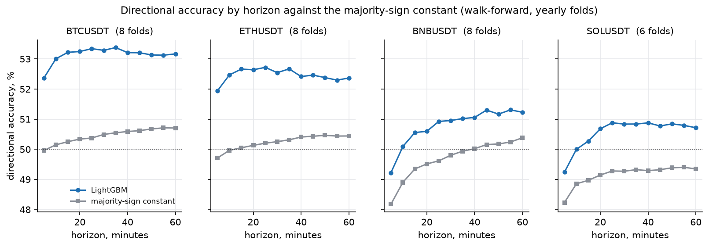
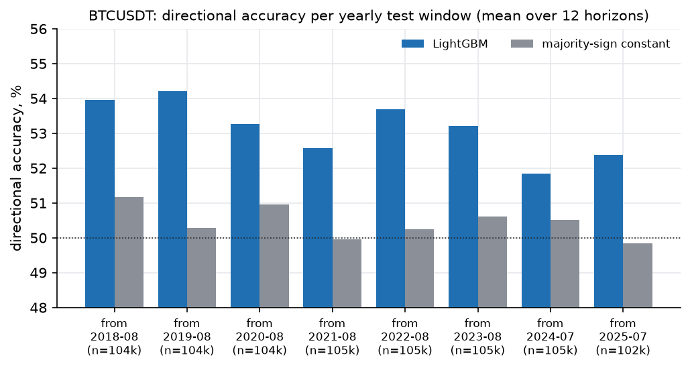
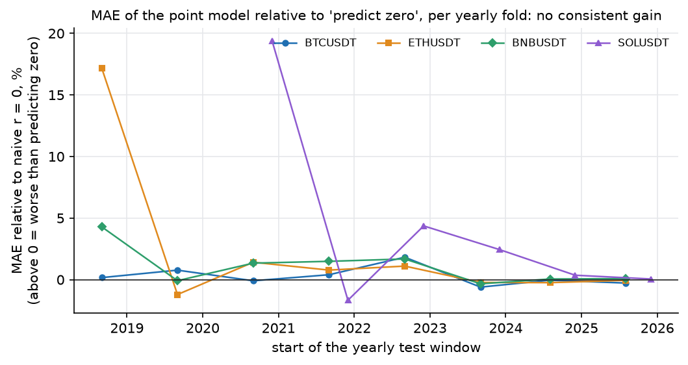
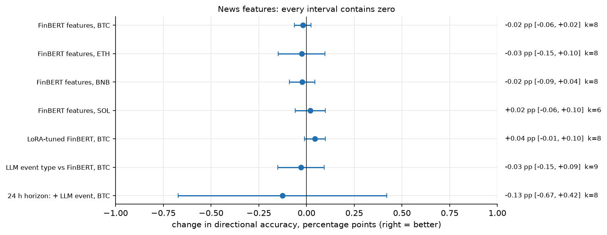
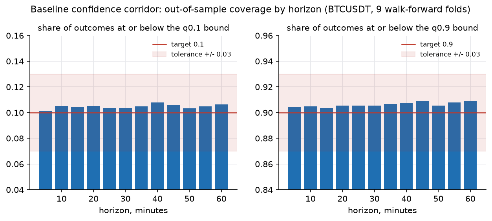
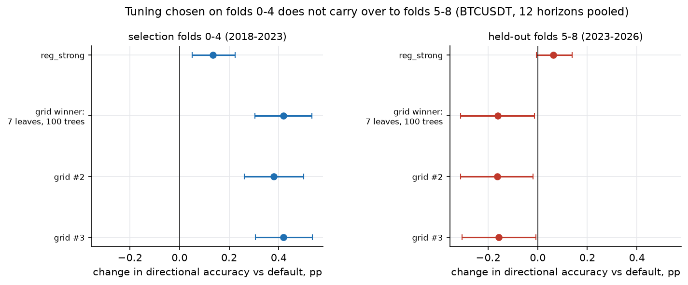
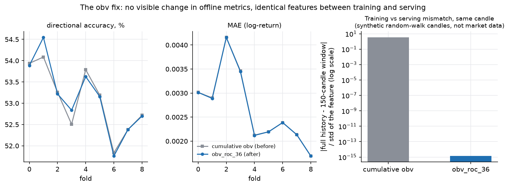

# Evaluation: method and every experiment

All numbers below come from the CSV files in [`reports/`](../reports/), from code docstrings, or from working notes that are not in the repository. Each number is tagged:

- **[CSV]**: recomputed from the committed files in this repository. Figures in [`docs/media/`](media/) are drawn from the same files by [`docs/figures/make_figures.py`](figures/make_figures.py); its printed output is saved in [`docs/figures/figure_numbers.txt`](figures/figure_numbers.txt).
- **[code]**: written in a docstring or comment of tracked code.
- **[notes]**: from the project's working notes, which are not in the repository. These cannot be re-checked from here.

[`reports/README.md`](../reports/README.md) is the original Russian working summary; this document is its English counterpart, extended with the hyperparameter search (section 13) and several corrections (list at the end).

## Contents

[Method](#method) · [Four caveats](#four-caveats-without-which-the-numbers-mislead) · [Verdict table](#verdicts) · [1 Naive baseline](#1-naive-baseline) · [2 LightGBM](#2-lightgbm-12-horizons) · [3 Training window](#3-training-window-length) · [4 Recency weights](#4-recency-weights) · [5 FinBERT features](#5-level-1-news-features-finbert-with-time-decay) · [6 LoRA](#6-level-3-lora-fine-tuning-of-finbert) · [7 LLM event type](#7-level-2-llm-event-type-60-minutes) · [8 24 h](#8-24-hour-horizon) · [9 2-6 h](#9-intermediate-horizons-2-6-hours) · [10 Novelty](#10-cross-article-novelty) · [11 Magnitude](#11-screen-size-of-the-move-and-news) · [12 Corridor](#12-confidence-corridor) · [13 Tuning](#13-hyperparameter-tuning) · [14 Experiments without surviving reports](#14-experiments-whose-reports-did-not-survive) · [15 obv](#15-the-obv-fix) · [Corrections](#corrections-to-the-earlier-summary) · [File index](#file-index)

## Method

**Target.** Log-return `r_h = log(close[t + 5h min] / close[t])` for `h = 1..12` (5 to 60 minutes), looked up by exact timestamp, so a gap in the candle series gives a NaN target instead of pairing wrong rows ([`features/targets.py`](../src/pinance_ml/features/targets.py)). A price target would be dominated by the current price and say almost nothing about the move within the hour.

**Walk-forward with purging** ([`splits.py`](../src/pinance_ml/splits.py)). The first test window starts 90 days after the first candle. Training uses everything before the test window (expanding), minus the last `PURGE_ROWS = 12` rows before the boundary, because their targets look up to 12 candles ahead, into the test period. The test window then slides forward. Shuffled splits are never used. LightGBM experiments use 365-day test windows: **8 folds** for BTC, ETH and BNB (2018-08 to 2026-07) and **6 folds** for SOL (windows start 2020-11-09, then yearly). About 105,000 test rows per fold and horizon; the last, partial window of some experiments adds a ninth fold with a few hundred rows. The naive baseline uses 7-day windows (416 folds), which is cheap because it trains nothing.

**Baselines** ([`baselines/naive.py`](../src/pinance_ml/baselines/naive.py)). For error size: `r = 0`, whose MAE is `mean|r|`. For direction: a constant, the majority sign of the training window. Every model is compared with them on the same windows.

**Metrics** ([`metrics.py`](../src/pinance_ml/metrics.py)). MAE in log-return units (0.0028 is about 0.28 %); directional accuracy (DA), the share of rows where the predicted sign equals the actual sign; for quantile models, pinball loss and coverage (share of outcomes at or below the predicted quantile; for an alpha-quantile model it should be close to alpha).

**Statistics suited to eight folds.**
- Per-fold values are averaged over the 12 horizons, then compared with a **paired t-test across folds**; pooled values are weighted by each fold's `n_test` ([`evaluation.pool_fold_metrics`](../src/pinance_ml/evaluation.py)). p-values are not corrected for the four symbols.
- Eight or nine folds cannot resolve a DA difference below about **1.5 percentage points** (minimum detectable effect 1.57 pp at 80 % power [notes]). Where DA matters, `evaluation.directional_block_bootstrap` resamples 7-day blocks of calendar days, about 400 near-independent units instead of nine folds. It assumes seven days are long enough to hold the autocorrelation of overlapping targets.
- Rows are not independent: neighbouring targets overlap, and returns and volatility are autocorrelated. Sample sizes quoted as `n_test` count rows, so interval widths based on them alone would be too narrow.

**What cannot be reproduced without the private database.** Every walk-forward result needs a TimescaleDB table of 5-minute candles (about 880,000 rows for BTC). The CSV files are committed so the numbers can be checked; the synthetic demo in [`docs/examples/`](examples/synthetic_walkforward_demo.py) runs the same code on generated data.

## Four caveats without which the numbers mislead

1. **LightGBM configuration.** Every CSV from 21 July to 2 August 2026 was computed with the committed `DEFAULT_PARAMS`: `regression_l1`, 300 trees, learning rate 0.05, 31 leaves, `min_child_samples` 100. The earlier `reports/README.md` says that on 30 August 2026 the point models were moved to a regularised `reg_strong` configuration. **The committed code does not do this**: `DEFAULT_PARAMS` is unchanged, `train_horizon_models` is called without `params` in both `export_models.py` and `auto_retrain.py`, and `reg_strong` appears only in the tuning and validation scripts. See [section 13](#13-hyperparameter-tuning). Quantile models use `DEFAULT_QUANTILE_PARAMS` (same capacity, `objective="quantile"`).
2. **`horizon_screen_summary.csv` stores an unweighted mean across folds.** For the 6-hour horizon that gives +0.28 pp, while the `n_test`-weighted value is -0.91 pp, because a tiny trailing fold (221 rows) counts as much as folds of about 105,000 rows ([section 9](#9-intermediate-horizons-2-6-hours)).
3. **Trailing partial folds.** The 24 h experiment's ninth fold has NaN metrics and is dropped (8 remain). In the quantile experiment fold 8 holds 386 rows.
4. **Column names.** In `train_window_comparison*.csv` and `recency_weighting_comparison*.csv` the `symbol` column holds the window length or half-life label; the symbol is BTCUSDT everywhere.

## Verdicts

"Bar" is the success criterion written in the script before the run, where the script records one ([code]). For the news experiments in sections 5 to 8 no bar is recorded in the repository; the verdict there is simply "no gain".

| # | Experiment | Bar recorded in code | Verdict |
|---|---|---|---|
| 1 | Naive baseline | none (it is the reference) | DA 49.2 to 50.5 % (constant), MAE = `mean|r|` |
| 2 | LightGBM, 12 horizons | none | MAE no better than naive (+0.25 to +6.3 %, not significant). DA above the constant by +1.1 to +2.7 pp |
| 3 | Training-window length | none | expanding window beats every sliding window |
| 4 | Recency weights | none | equal weights beat every decay |
| 5 | FinBERT features | none | no gain, MAE slightly worse on all four symbols (not significant) |
| 6 | LoRA-tuned FinBERT | none | no gain; line closed |
| 7 | LLM event type, 60 min | none | no gain; the link is with the size of the move, not direction |
| 8 | 24 h horizon | none | no gain |
| 9 | Horizons 2 to 6 h | none | no out-of-sample predictability |
| 10 | Cross-article novelty | majority of folds positive, and survives news-volume control | formally passed, read as null (p = 0.77) |
| 11 | Screen: size of move | descriptive only | link exists, small |
| 12 | Corridor + event type/magnitude | pinball gain >= 1 %, p < 0.05, coverage in tolerance | **null**: +0.12 %, p = 0.135 |
| 13 | Tuning (`reg_strong`, 144-cell grid) | held-out 95 % CI of the DA change above 0 | **not passed**; grid winner reverses on held-out folds |
| 14 | Vol-scaled target, funding, OFI, micro, news via DA harness | 0.5 % MAE bar (vol-scaled), 1 % pinball bar (funding) | reports lost; see section 14 |
| 15 | `obv` fix | none | no visible offline change; fixes a serving skew |

## 1. Naive baseline

Script `scripts/run_naive_baseline.py`; files `naive_baseline_folds.csv`, `naive_baseline.csv`; run 21 July 2026.

`naive_baseline_folds.csv` is walk-forward with weekly windows (416 folds for BTC/ETH/BNB, 298 for SOL). `naive_baseline.csv` is an earlier single 80/20 split (about 690,000 / 172,000 rows for BTC), not walk-forward. Over the yearly windows used in section 2 the naive numbers are: BTC MAE 0.002792 and constant-direction DA 50.45 %; ETH 0.003720 and 50.23 %; BNB 0.003704 and 49.69 %; SOL 0.005491 and 49.15 % [CSV].

## 2. LightGBM, 12 horizons

Script `scripts/train_lightgbm.py`; files `lightgbm_folds.csv` (BTC), `lightgbm_folds_rest.csv` (ETH, BNB, SOL); run 21 July 2026 with `DEFAULT_PARAMS`.

Question: does a model on technical features beat the naive baselines? The naive numbers are recomputed on exactly the yearly windows of each LightGBM fold from the weekly folds that start inside them (row coverage 99.2 to 101.7 %).

| Symbol | Folds | MAE LightGBM | MAE naive | Change | Folds better | p | DA LightGBM | DA constant | Change | Folds better | p |
|---|---|---|---|---|---|---|---|---|---|---|---|
| BTCUSDT | 8 | 0.002799 | 0.002792 | +0.25 % | 4/8 | 0.29 | 53.14 % | 50.45 % | **+2.69 pp** | 8/8 | < 0.001 |
| ETHUSDT | 8 | 0.003821 | 0.003720 | +2.72 % | 4/8 | 0.30 | 52.47 % | 50.23 % | **+2.23 pp** | 8/8 | < 0.001 |
| BNBUSDT | 8 | 0.003752 | 0.003704 | +1.29 % | 2/8 | 0.10 | 50.79 % | 49.69 % | +1.10 pp | 7/8 | 0.03 |
| SOLUSDT | 6 | 0.005836 | 0.005491 | +6.27 % | 1/6 | 0.30 | 50.56 % | 49.15 % | +1.41 pp | 6/6 | < 0.001 |

[CSV, `make_figures.py`.] Pooled by `n_test`; paired t-test across folds; four symbols, no multiple-comparison correction.

*LightGBM (blue) against the majority-sign constant (grey), pooled over folds, by horizon. BTC and ETH sit about 2 to 3 pp above the constant at every horizon; BNB and SOL are above it by about 1 to 1.5 pp, and on the 5-minute horizon BNB and SOL are below 50 %. About 837,000 rows per horizon for BTC, ETH and BNB, 599,000 for SOL.*

*BTCUSDT directional accuracy per yearly window (mean over the 12 horizons). The edge over the constant is 2.8 and 3.9 pp in the first two windows and 1.3 and 2.5 pp in the last two; the model itself falls from 53.96 % (2018) to 51.83 % and 52.37 % in the last two windows.*

*MAE of the model relative to `r = 0`, per yearly window. Values above zero mean worse than predicting zero. The first windows of ETH, BNB and SOL are worse by 4 to 19 %; the last two windows of every symbol are within about 0.5 % of the baseline.*

Reading. On error size the point model does not beat "predict zero" on any symbol (no significant difference). The signal is in direction: DA is above the constant in every fold of BTC, ETH and SOL, most clearly for BTC and ETH. For BTC, DA is 52.4 % at h = 1 and 53.0 to 53.4 % at h >= 2. The result is before transaction costs and is not a trading result.

## 3. Training-window length

Script `scripts/compare_train_windows.py`; files `train_window_comparison.csv`, `_per_horizon.csv`, `_summary.csv`; BTCUSDT, technical features only, 8 folds; run 26 July 2026.

| Window | MAE | DA | Change in MAE | p | Change in DA | p |
|---|---|---|---|---|---|---|
| expanding | 0.0027959 | 53.14 % | | | | |
| 730 d | 0.0028059 | 52.98 % | +0.36 % | 0.13 | -0.16 pp | 0.03 |
| 365 d | 0.0028277 | 52.74 % | +1.13 % | 0.07 | -0.39 pp | 0.06 |
| 180 d | 0.0028836 | 52.49 % | +3.15 % | 0.04 | -0.65 pp | 0.004 |
| 90 d | 0.0029220 | 52.13 % | +4.51 % | 0.002 | -1.01 pp | 0.002 |

[Reports summary; paired against expanding.] Quality grows monotonically with window length, so the expanding window is used in training (`max_train_days=None`). The sliding variant (`max_train_days`) still exists in `walk_forward_folds`; only `compare_train_windows.py` uses it.

## 4. Recency weights

Script `scripts/compare_recency_weighting.py`; files `recency_weighting_comparison*.csv`; BTCUSDT, expanding window, 8 folds; run 27 July 2026. The equal-weight baseline was not re-run; it is the `expanding` row of section 3, as the script's docstring says.

| Half-life | MAE | DA | Change in MAE | p | Change in DA | p |
|---|---|---|---|---|---|---|
| 730 d | 0.0028048 | 52.98 % | +0.32 % (worse in 7/8) | 0.06 | -0.16 pp | 0.02 |
| 180 d | 0.0028254 | 52.80 % | +1.05 % (worse in 7/8) | 0.07 | -0.34 pp | 0.002 |
| 30 d | 0.0028685 | 52.39 % | +2.59 % (worse in 8/8) | 0.02 | -0.75 pp | < 0.001 |

Any decay is worse than equal weights; recency weighting is not used.

## 5. Level 1: news features (FinBERT with time decay)

Script `scripts/measure_news_feature_gain.py`; files `news_feature_gain_folds.csv`, `_summary.csv`, `_importance.csv`, `news_feature_gain.log`, `btc_pilot_folds.csv`; run 23 July 2026. Variants `technical_only` and `with_news`.

`with_news` adds six features: `sentiment_weighted`, `sentiment_dispersion`, `news_intensity`, `max_magnitude_60m`, `event_hack_60m`, `event_regulation_60m`. News enters through exponential decay `w = exp(-lambda * dt)` with a 90-minute half-life, and each item is stamped with its **publication** time, never its parse time, so the features cannot look ahead.

| Symbol | Folds | Change in MAE | p | Change in DA | p |
|---|---|---|---|---|---|
| BNBUSDT | 8 | +0.079 % | 0.16 | -0.023 pp | 0.45 |
| BTCUSDT | 8 | +0.047 % | 0.27 | -0.020 pp | 0.32 |
| ETHUSDT | 8 | +0.103 % | 0.55 | -0.026 pp | 0.64 |
| SOLUSDT | 6 | +0.065 % (worse in 6/6) | 0.08 | +0.019 pp | 0.56 |

[Reports summary.] For BTC the six news features take about 6.1 % of the total split gain (`sentiment_weighted` 1.92 %, `sentiment_dispersion` 1.83 %, `news_intensity` 1.69 %, `max_magnitude_60m` 0.58 %, the other two under 0.05 %) [CSV, `news_feature_gain_importance.csv`] and still add nothing out of sample: the model spends capacity on them.

*Change in DA for every news experiment (unweighted mean over folds, 95 % t-interval, `k` folds; the same differences as in the tables, drawn as intervals). Every interval contains zero. The 24 h interval is wide (k = 8, one fold of about 105,000 correlated rows each).*

## 6. Level 3: LoRA fine-tuning of FinBERT

Scripts `build_finbert_labels.py`, `finetune_finbert_lora.py`, `rescore_and_measure_gain.py`; files `finbert_lora_gain_folds.csv`, `finbert_lora_gain_summary.csv`; run 28 July 2026.

Idea: label each news item with the sign of the asset's return 60 minutes after publication, fine-tune FinBERT on those market-derived labels (no human labelling), re-score the news, and compare features with the baseline ones.

On disk [CSV]: BTCUSDT, 8 folds, titles only: change in MAE +0.025 % (p = 0.60), change in DA +0.045 pp (p = 0.09, positive in 6/8 folds). The file does not record which configuration was scored; by date and title-only input it is one of configurations 1 and 2.

Language-model training [notes]: five configurations, all stuck at `eval_loss` near ln 3 = 1.099 (chance level for three classes).

| # | Configuration | Result |
|---|---|---|
| 1 | title only, lr 2e-4 | flat |
| 2 | + asset prefix | flat |
| 3 | + prefix, lr 1e-3 | collapse to the majority class |
| 4 | + article body (BTC) | flat, downstream p = 0.50 |
| 5 | + article body, all four assets | eval_loss 1.102, accuracy 33.55 %; downstream not run |

Verdict: "headline or article to sign of the price after 60 minutes" holds no learnable signal for LoRA-FinBERT. The line is closed; repeating it needs a new hypothesis (another label horizon, magnitude instead of sign, another model). The label files (`finbert_labels.csv` 10.9 MB, `finbert_labels_with_body.csv` 136 MB with full article text) are not tracked and are rebuilt by `build_finbert_labels.py`.

## 7. Level 2: LLM event type (60 minutes)

Scripts `score_pending_news_llm.py`, `measure_llm_event_gain.py`; files `llm_event_gain_folds.csv`, `llm_event_gain_summary.csv`; run 31 July 2026. Variants `technical_only`, `with_level1_news`, `with_level1_and_llm_events` (Qwen2.5-3B-Instruct, GGUF Q4 through llama.cpp on CPU, classifying each item into one of ten categories). BTCUSDT, 9 folds.

| Comparison | Change in MAE | p | Change in DA | p |
|---|---|---|---|---|
| Level 1 against technical | +0.047 % | 0.17 | -0.02 pp | 0.28 |
| LLM against Level 1 | -0.026 % | 0.83 | -0.03 pp | 0.59 (positive in 5/9 folds) |

By horizon, the change in DA (LLM against Level 1) lies between -0.056 and +0.084 pp, positive at 8 of 12 horizons, with no pattern [CSV].

How it went [notes]:
1. A pilot on 300 news items found `novelty` and `is_speculative` degenerate (100 % constant). A few-shot prompt removed the degeneracy but weakened the correlation with returns. The task was narrowed to `event_type`; the backfill of 24,834 BTC items took about 4.1 hours.
2. Mutual information of `event_type` with |r| is 0.0498 against a null level of 0.0017 +/- 0.0027, so a link with the **size** of the move is real. Its link with the sign is about 100 times smaller. It is not explained by yearly volatility regimes and is about 15 % explained by technical volatility features.
3. Kruskal-Wallis p-values by horizon (sign / |r|): 5 min 0.145 / 0.00032; 15 min 0.090 / 0.046; 30 min 0.228 / 0.00011; 60 min 0.060 / 0.000002; 240 min 0.0034 / about 0; 24 h about 0 / 0.00072.

Verdict: no gain for the point forecast of direction. The signal concerns magnitude, which motivated the corridor test of section 12. `pilot_level2_extraction.csv` contains article text and is not tracked.

## 8. 24-hour horizon

Script `scripts/measure_24h_horizon_baseline.py`; files `horizon_24h_baseline_folds.csv`, `horizon_24h_baseline_summary.csv`; run 1 August 2026. BTCUSDT, target `r_288`, separate `LONG_HORIZONS` and `LONG_PURGE_ROWS = 288`, so the 24 h model does not widen the purge of the short-horizon models. Nine folds, the ninth NaN, eight remain.

| Variant | DA | MAE |
|---|---|---|
| technical_only | 50.72 % | 0.02392 |
| + Level 1 | 50.59 % | 0.02419 |
| + Level 1 + LLM `event_type` 24 h | 50.86 % | 0.02418 |

[CSV.] LLM against Level 1: +0.26 pp DA, p = 0.60, better in 4 of 8 folds, fold values from -2.11 to +1.94 pp. Level 1 against technical: -0.13 pp DA (p = 0.60), MAE +1.1 % (p = 0.36).

More [notes]: the feature `event_llm_{type}_24h` is degenerate (`market_move_24h` is true on 80 % of timestamps; on average 3.7 of the 10 flags are on at once). A rebuilt `recent_category_24h`, tested without LightGBM, reached 51.0 % against a base rate of 52.2 % (-1.19 pp), better than the base in 2 of 8 folds. A collinearity check (33.2 % against 31.7 %) shows the news category is not recoverable from the existing features. Verdict: a statistical link between `event_type` and the 24 h direction exists over the full history, but it is not stable in time and does not work out of sample.

## 9. Intermediate horizons (2-6 hours)

Script `scripts/screen_intermediate_horizons.py`; file `horizon_screen_summary.csv`; run 1 August 2026. A marginal test without LightGBM: P(up | last news category in the window), fitted per fold, applied out of sample; the feature window equals the horizon.

| Horizon | Change, unweighted [CSV] | Change, `n_test`-weighted [notes] | Folds above base rate |
|---|---|---|---|
| 2 h | -0.19 pp | -0.16 pp | 4/9 |
| 3 h | -0.57 pp | -0.68 pp | 4/9 |
| 4 h | -0.35 pp | -1.04 pp | 3/9 |
| 6 h | **+0.28 pp** | **-0.91 pp** | 4/9 |

The sign at 6 h in the CSV misleads: the unweighted mean counts a trailing fold of 221 rows equally with folds of about 105,000. The weighted values are not saved in a file; they come from the script output recorded in the notes. Rule used from here on: aggregate folds with `n_test` weights. Verdict: no out-of-sample direction signal from 60 minutes to 24 hours.

## 10. Cross-article novelty

Script `scripts/screen_cross_article_novelty.py`; run 1 August 2026. **There is no result file**: the script prints to stdout only, so the figures below are [notes].

Feature: `novelty = 1 - max cosine similarity` (all-MiniLM-L6-v2 embeddings) to other articles about the same asset in the previous 24 hours. The criterion in the script's docstring: the `n_test`-weighted marginal delta above zero in a majority of folds, and robust to news volume of the same asset.

Result (7 valid folds): +1.37 pp, +1.30 pp after neutralising news volume, positive in 4 of 7 folds. Paired t-test t = 0.307, p = 0.77; minimum detectable effect 4.89 pp. One fold contributes +6.6 pp and another -5.3 pp. Verdict: the criterion is formally met but weak (a simple majority of seven folds), and is read as null. Lesson drawn: a criterion must also demand significance of the paired test.

Overall for sections 6 to 10: six independent attempts, three mechanisms; no out-of-sample news signal for BTC direction [notes].

## 11. Screen: size of the move and news

Script `scripts/screen_quantile_magnitude_signal.py`; files `quantile_screen_by_category.csv`, `quantile_screen_by_magnitude_bucket.csv`; run 1 August 2026. Mean |r_12| (60 minutes) over the whole BTC history, no walk-forward. **Descriptive statistics, no control for era.**

- No recent news: 0.003795 (658,719 candles).
- With news, by category: 0.00421 (macro) to 0.00477 (partnership), 11 to 26 % higher.
- By magnitude bucket: q1 0.00435, q2 0.00434, q3 0.00431, q4 0.00454; a real gradient only in the top bucket.

By the notes: Kruskal-Wallis H = 3762, p about 0; regression on buckets r² = 0.0015. The link is real but small.

## 12. Confidence corridor

Script `scripts/measure_quantile_gain.py`; files `quantile_gain_folds.csv`, `quantile_gain_summary.csv`, `quantile_gain.log`; run 1 to 2 August 2026, 176.6 minutes. BTCUSDT, 9 folds, 12 horizons x 3 quantiles (0.1, 0.5, 0.9). Variants `technical_only` and `with_event_and_magnitude` (`event_llm_type_60m` and `max_magnitude_60m`).

**The baseline corridor is calibrated** [CSV, recomputed]:

| Quantile | Coverage, pooled by `n_test` | Mean over the 108 fold-horizon cells | Folds within +/-0.03 of nominal |
|---|---|---|---|
| 0.1 | 0.105 | 0.110 | 6/9 |
| 0.9 | 0.906 | 0.910 | 7/9 |

The earlier summary quoted the unweighted means (0.1105 and 0.9102). The `n_test`-weighted values are the ones consistent with section 9's rule; the nominal levels are 0.1 and 0.9. The worst fold for q = 0.1 is fold 0 (coverage 0.167), which has only about 90 days of training data. Fold 8 holds 386 rows.

*Share of BTCUSDT outcomes at or below the q0.1 bound (left) and the q0.9 bound (right), by horizon, pooled over nine walk-forward folds. The red line is the nominal level and the band is the +/-0.03 tolerance used by the push gate.*

**Hypothesis (event type and magnitude) against the bar** (pooled pinball loss 0.000894):

| Condition | Bar | Result | Met |
|---|---|---|---|
| Pinball improvement | >= 1.0 % | +0.12 % (delta -0.000001) | no |
| Significance across folds | p < 0.05 | t = -1.663, p = 0.135 (6/9 folds in favour of the candidate) | no |
| Coverage in tolerance | majority of folds | 7/9 and 7/9 | yes |

The minimum detectable effect at 80 % power is 0.000002 absolute, so an effect of the planned size would have been detected: this is a real null, not lack of power. The values t = -1.663, p = 0.135 and 6/9 were reproduced from `quantile_gain_folds.csv`. Verdict: the news magnitude signal does not improve the corridor on top of about 93 technical features. The infrastructure (`pinball_loss`, `coverage`, `train_quantile_models`) stays in use for the production corridor.

The corridor on the live system looks different from this offline result: over long windows the live BTC lower bound is exceeded by 4.5 % of outcomes against a 10 % target (see the backend repository).

## 13. Hyperparameter tuning

Scripts `tune_lightgbm_directional.py`, `gridsearch_lightgbm.py`, `validate_reg_strong.py`; files in `reports/gridsearch/` (`screen_folds.csv`, `screen_ranked.csv`, `confirm_folds.csv`, `confirm_daily.csv`). The earlier summary describes this work only through notes (its section 13); the grid-search files are in the repository and were not covered by it.

**Question.** `DEFAULT_PARAMS` has been fixed since the start. Checks of news and microstructure features showed the model spends 6 to 9 % of its split gain on inputs that add nothing out of sample, i.e. it overfits weak inputs. Does a more regularised configuration help?

**Protocol [code].** Folds 0 to 4 (2018 to 2023) select, folds 5 to 8 (2023 to 2026) judge. A configuration counts as an improvement only if the 95 % day-block-bootstrap interval of its pooled change in DA against the default excludes zero on the positive side on the held-out folds, and it was not worse than the default on the selection folds.

**Stage 1, screen** (`gridsearch_lightgbm.py`). 144 candidates (`num_leaves` 7/15/31/63 x `min_child_samples` 100/300/500 x subsampling none/mid/strong x 100/200/300/400 trees), folds 0 to 4, horizons 1, 6, 12. DA ranges from 53.18 % to 53.82 % [CSV, `screen_ranked.csv`]; the best candidate (7 leaves, 100 trees) is +0.46 pp above the default.

**Stage 2, confirm.** The default, `reg_strong` and the top three grid cells, all 12 horizons, all 9 folds, BTCUSDT; day-block bootstrap with 7-day blocks and 4,000 draws (the table is the figure script's output; the function's default of 10,000 draws moves interval ends by about 0.004 pp):

| Candidate | Folds 0-4: change in DA [95 % interval] | Folds 5-8: change in DA [95 % interval] | Change in MAE, folds 5-8 |
|---|---|---|---|
| `reg_strong` (15 leaves, `min_child_samples` 500, 400 trees, lr 0.04, feature fraction 0.6, bagging 0.7, L1 = L2 = 1) | +0.135 pp [+0.05, +0.22] | **+0.062 pp [-0.006, +0.139]** | -0.06 % |
| grid winner (7 leaves, 100 trees, mid subsampling) | +0.418 pp [+0.30, +0.53] | **-0.161 pp [-0.31, -0.014]** | -0.02 % |
| grid #2 | +0.381 pp [+0.26, +0.50] | -0.164 pp [-0.31, -0.019] | -0.03 % |
| grid #3 | +0.418 pp [+0.31, +0.54] | -0.158 pp [-0.31, -0.008] | -0.02 % |

[CSV, `confirm_daily.csv` through `directional_block_bootstrap`; 1,826 days in folds 0-4 and 1,148 days in folds 5-8.]

*Change in directional accuracy against the default, pooled over 12 horizons, BTCUSDT. Left: folds used to select. Right: held-out folds. Blue: interval above zero. Red: interval contains or lies below zero. The configurations that look best on the selection folds are not better, and the grid winner is worse, on the held-out folds.*

**Verdict.** The grid's selection-fold gain (up to +0.42 pp) is the winner's curse: it reverses on the held-out folds. `reg_strong` has a positive point estimate on both fold sets, but on this data (which runs to 2026-09-21) its held-out interval includes zero (-0.006 pp), so it does not meet the bar. `validate_reg_strong.py` says in its docstring that `reg_strong` "passed the pre-registered directional bar on BTCUSDT" in the earlier tuning run; those result files (`tune_directional_*.csv`) are not in the repository, so the two statements cannot be reconciled from here. The most likely cause is the longer data in `confirm_daily.csv`, but that is an inference. The earlier summary reports that on the cross-symbol validation (ETH, BNB, SOL) `reg_strong` did not pass the DA bar on held-out folds for individual symbols, and describes it as adopted for its MAE effect (-0.3 to -3.5 % on all four symbols) [notes]. It also records `reg_strong` as adopted on 30 August 2026; **the committed code does not use it** (first caveat), and the DA and MAE tables of section 2 are for the default configuration. `validate_reg_strong_*.csv` are not in the repository either.

## 14. Experiments whose reports did not survive

The result files of the following were not found when the summary was written (2026-09-22: not in `reports/`, nor in any worktree, nor in the home directory; MLflow was not configured on that machine). Only what tracked code records is stated here [code]:

| Experiment (script) | What the code records |
|---|---|
| Vol-scaled target (`measure_vol_scaled_target_gain.py`) | A target `r_h / sigma` helped MAE by about 1.5 % in fold 4 (2022) and hurt in 2018. Not adopted. Bar in the script: 0.5 % relative MAE |
| Funding rate, marginal screen (`screen_funding_signal.py`) | No consistent link of funding z-score with the sign of the 30 to 60 minute return on any of four symbols. A stable link of |funding z| with |r| on all symbols and horizons (panel Newey-West t from +5 to +7), top against bottom quartile about +8 to +13 % in |r| |
| Funding in the corridor (`measure_funding_feature_gain.py`) | Same bar as section 12 (1 % pinball). **The outcome is recorded nowhere.** Funding features exist only in `scripts/_feature_sets.py`, not in `src/` |
| Error by regime (`screen_regime_error.py`) | Together with the two above: the point models sit at the naive floor on MAE in every regime. DA (about 53 %) has a stable structure across regimes |
| DA harness (`measure_directional_gain.py`, `compare_daily.py`) | Day-block bootstrap, about 400 blocks instead of nine folds. Feature sets: funding, micro, OFI, news |
| OHLCV microstructure, order-flow imbalance (`screen_ofi_signal.py`, `fetch_agg_trades_ofi.py`), news through the DA harness | Each set: the model spends 6 to 9 % of split gain on inputs that add nothing out of sample. Individual outcomes not recorded |

These are listed as "tried, no recorded gain", not as measured results.

## 15. The obv fix

Files `obv_fix_btc_old_folds.csv`, `obv_fix_btc_new_folds.csv`; run 1 October 2026, BTCUSDT only, `scripts/train_lightgbm.py` with the same code and parameters; only the feature differs.

Cumulative on-balance volume `obv` was replaced by the windowed `obv_roc_36` (signed volume over 36 candles divided by volume over the same candles). In serving the model sees only the last 150 candles, so a cumulative sum starts from a different place than in training. In the regression test's synthetic data (5,000 candles against the last 150) the old `obv` differed from the full-history value by about 73 % [code: commit message and test]. This is a synthetic figure: the cumulative sum's size depends on history length, and it was not measured on real candles. The new feature agrees exactly.

Effect on offline metrics (nine folds, `n_test`-weighted, mean over h = 1..12) [CSV]:

| | MAE | DA |
|---|---|---|
| `obv` (before) | 0.00277 | 53.11 % |
| `obv_roc_36` (after) | 0.00277 | 53.17 % |
| Change | -0.13 % | +0.05 pp |

Paired t-test across folds: MAE p = 0.098, DA p = 0.52, so no difference. Offline metrics barely move because training and test both saw `obv` in the same form. The damage was in serving, where the feature had a different distribution, and offline evaluation cannot see that. What catches it is `tests/test_pipeline.py::test_serving_window_features_match_full_history`: it compares the last feature row computed on 5,000 candles with the one computed on the last 150. With the old cumulative formula restored in a scratch copy, that test fails (`-4880.56` against `-1296.17` on synthetic candles) and the other eight tests in the file pass; with the fix, all nine pass.

*Left and middle: per-fold DA and MAE for BTCUSDT before and after (real walk-forward results). Right: the training-serving mismatch of both formulas on synthetic random-walk candles (not market data), as the mean of the absolute difference between the full-history value and the 150-candle value, divided by the feature's standard deviation (log scale).*

Not checked: ETH, BNB and SOL were not re-evaluated, and the models that were in storage before the change were not retrained for this reason (the retraining that followed was for the new schema, see [deployment](deployment.md#schema-changes)). The other indicators (RSI, MACD, ATR) are exponential smoothers; on a 150-candle window their relative difference from the full-history value is below about 1e-4 (the test allows `rtol = 1e-4`; the demo shows 5.3e-05 at most).

## Corrections to the earlier summary

1. Section 12 coverage: the n-weighted means are 0.105 and 0.906; the earlier text quoted unweighted means.
2. Section 2, SOL MAE change: +6.27 % here (earlier +6.09 %); BNB MAE 0.003752 here (earlier 0.003749). The naive MAE is recomputed from weekly folds that start inside each yearly window, and the two calculations weight the edge windows slightly differently. Conclusions are unchanged.
3. Section 15: the old repository README said the old `obv` differed "by about 100 %"; the commit message and test comment say about 73 %, which is a figure from the synthetic regression test, not a measurement on market data. This document labels it that way.
4. The `reg_strong` adoption on 30 August 2026 is not reflected in the committed code (first caveat, section 13).
5. Section 13 (grid search) was missing from the earlier summary although its CSV files are tracked.

## File index

| File | Script | Section |
|---|---|---|
| `naive_baseline.csv`, `naive_baseline_folds.csv` | `run_naive_baseline.py` | 1 |
| `lightgbm_folds.csv`, `lightgbm_folds_rest.csv` | `train_lightgbm.py` | 2 |
| `train_window_comparison{,_per_horizon,_summary}.csv` | `compare_train_windows.py` | 3 |
| `recency_weighting_comparison{,_per_horizon,_summary}.csv` | `compare_recency_weighting.py` | 4 |
| `news_feature_gain_{folds,summary,importance}.csv`, `news_feature_gain.log`, `btc_pilot_folds.csv` | `measure_news_feature_gain.py` | 5 |
| `finbert_lora_gain_{folds,summary}.csv` | `rescore_and_measure_gain.py` | 6 |
| `llm_event_gain_{folds,summary}.csv` | `measure_llm_event_gain.py` | 7 |
| `horizon_24h_baseline_{folds,summary}.csv` | `measure_24h_horizon_baseline.py` | 8 |
| `horizon_screen_summary.csv` | `screen_intermediate_horizons.py` | 9 |
| `quantile_screen_by_{category,magnitude_bucket}.csv` | `screen_quantile_magnitude_signal.py` | 11 |
| `quantile_gain_{folds,summary}.csv`, `quantile_gain.log` | `measure_quantile_gain.py` | 12 |
| `gridsearch/{screen_folds,screen_ranked,confirm_folds,confirm_daily}.csv` | `gridsearch_lightgbm.py` | 13 |
| `obv_fix_btc_{old,new}_folds.csv` | `train_lightgbm.py BTCUSDT` before and after the fix | 15 |
| `news_parser.log` | one parser cycle, 27 July | operational |

Not tracked (see `.gitignore`): `finbert_labels.csv`, `finbert_labels_with_body.csv` (over 100 MB, article text), `pilot_level2_extraction.csv` (article text), `*_cache/` and `*.parquet`. They are rebuilt from the news database. Reproduction needs `DATABASE_URL` (candles) and `NEWS_DATABASE_URL` (news). Rough durations: the quantile experiment about 3 hours, each recency variant about 28 minutes, LoRA configuration 5 about 2.5 hours.
